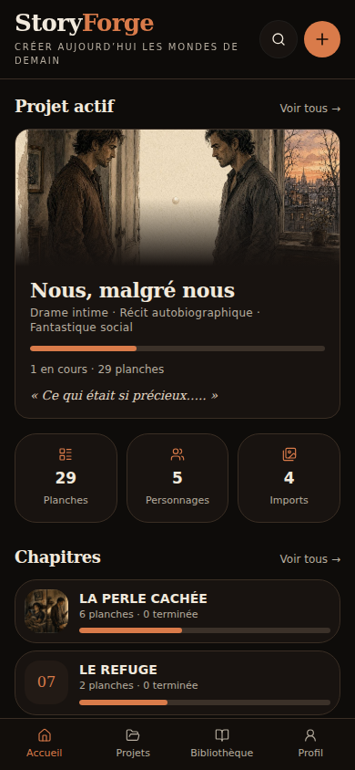
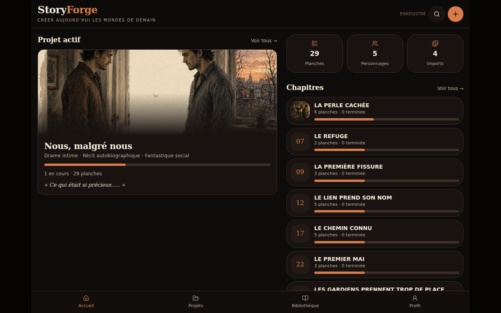

# Vérification StoryForge — branche grok-app

Base inspectée : `049ef34a8946b89c77487c5a13f511541873f3a8`. Vérification terminée le 23 septembre 2026.

L'application React/TanStack, son stockage local, son design, les 29 planches et les 152 cases sont conservés. Le fichier canonique `src/data/seed.json` et les images sources n'ont pas été modifiés.

## Défauts corrigés

- **Restauration destructrice** : la version initiale effaçait IndexedDB sans réimporter les images. Une sauvegarde invalide pouvait aussi vider les médias. Validation et décodage précèdent maintenant toute écriture ; remplacement des médias dans une transaction ; contrôle du quota de stockage avant remplacement ; restauration des anciennes métadonnées en cas d'échec de la transaction.
- **Sauvegardes incomplètes** : le JSON de session embarqué dans le ZIP omettait les données d'image. Il inclut maintenant les médias, et un export JSON de session directement restaurable est disponible. Le ZIP contient aussi les images déjà livrées avec l'application, et ses chemins ne dépendent pas de noms de médias non validés.
- **Copie canonique mutable** : les modifications de travail partageaient leurs objets avec le seed officiel, ce qui faussait la remise à zéro et les comparaisons de cohérence. La normalisation clone maintenant les données.
- **Imports et persistance** : validation structurelle, identifiants uniques, projet vide accepté, métadonnées normalisées, filtres périmés réinitialisés. Les changements en attente sont enregistrés quand l'onglet passe en arrière-plan. Une sauvegarde locale illisible est conservée sans être écrasée automatiquement. Les erreurs d'enregistrement restent visibles sur mobile.
- **Navigation et édition** : le filtre de chapitre ne se réapplique plus après « Tout voir » ; les actions du menu ne déclenchent plus l'ouverture de la planche ; une recherche utilise les modifications récentes et ouvre la case choisie ; les notes suivent leur planche lors de la navigation et apparaissent aussi dans les notes du projet.
- **Fonctions présentes mais inaccessibles** : raccordement de la grille 3 × 3, des dimensions des cases, des états des gardiens, du statut de case et de l'aperçu de lettrage. Les bulles s'affichent dans l'éditeur, les vignettes et la grille. Le déplacement est sauvegardé et ses écouteurs sont retirés à la fin/annulation.
- **Textes et cohérence** : les opérations de stockage respectent le verrou des textes exacts ; supprimer/détacher un texte ne vide pas silencieusement la bulle associée ; les dérogations de gardien par case ne provoquent plus une fausse alerte ; les restrictions éditoriales suivent l'identité canonique après réorganisation.
- **Impression** : attente du chargement des images, exclusion des commandes de l'application, échappement des URL et restitution du style des bulles.
- **Démarrage** : le bouton d'entrée attend l'hydratation ; le lockfile tronqué est régénéré ; `startup.sh` fonctionne depuis le dossier du projet.

Les deux défauts de perte de données ont été reproduits sur la révision initiale : modification de la copie canonique par une édition de travail et effacement des médias lors de la restauration de `{}`.

## Résultats

- `npm ci --dry-run --ignore-scripts` : réussi, lockfile exploitable.
- `npm run typecheck` et `npm run build` : réussis.
- `npm test` : **261 tests réussis**, 4 tests documentaires Grok explicitement ignorés car les fichiers `.grok/skills/og` ne sont pas fournis dans ce dépôt. Les tests génériques d'injection PWA sont isolés de l'identité StoryForge ; la logique de production n'a pas été modifiée pour les faire passer.
- `npm run test:browser` : **26 vérifications réussies**, réparties entre 390 × 844 et 1280 × 844, puis **les mêmes 26 sur la version compilée**. Contextes de navigateur neufs, données de test locales uniquement.
- Parcours : entrée, chapitres, réorganisation, édition, statut, ajout d'image, lettrage et déplacement, dimensions, prompt, notes, clavier, rechargement, gardiens, grille, recherche, sauvegarde/restauration, rejet de JSON invalide, ZIP, ajout/suppression, impression, bibliothèque et cohérence.
- Les deux ZIP téléchargés ont été ouverts et contrôlés : intégrité CRC correcte, quatre images présentes, média importé inclus dans le JSON de session.
- Rendu mobile et ordinateur inspecté sur développement et production : aucun débordement horizontal, aucune erreur JavaScript non interceptée, aucune divergence de contenu entre les deux rendus.

## Limites explicites

Le test de rendu générique signale deux échecs réseau propres à cet environnement : la feuille de style Google Fonts et `https://grok.com/grok-app-builder/extensions.js` renvoient `ERR_EMPTY_RESPONSE`. La typographie de secours est donc celle visible dans les captures. L'intégration Grok reste intacte. Ces ressources externes ne sont pas déclarées validées et le verdict générique n'est pas présenté comme entièrement vert.

Le script signale aussi l'absence préexistante de carte sociale personnalisée. Aucune nouvelle identité visuelle n'a été créée pour cet audit.

Les essais couvrent Chromium en formats mobile et ordinateur, pas un appareil Android physique ni tous les navigateurs. Aucun déploiement existant n'a été modifié.

## Captures de la version compilée

